# Mosque Management
> Generated by [`prisma-markdown`](https://github.com/samchon/prisma-markdown)

- [default](#default)

## default

```mermaid
erDiagram
"notification" {
  String id PK
  String sender "nullable"
  String title
  String message
  String photoUrl "nullable"
  DateTime dtCreated
  Boolean isReaded
  DateTime sentAt
  NotificationStatus status
}
"UserNotification" {
  String id PK
  String user_id FK
  String notif_id FK
}
"User" {
  String id PK
  String emailAddress
  String username
  String hashedPassword
  String api_token "nullable"
  String isConfirmed
  DateTime date_created
  DateTime date_modified "nullable"
  Role role
}
"Position" {
  String id PK
  String userId FK
  String eventId FK "nullable"
  String name
  String periode
  DateTime date_created
  DateTime date_modified "nullable"
}
"FamilyMember" {
  String id PK
  String participantId FK
  String name
  String information
  String relationType
}
"Participant" {
  String id PK
  String user_id FK
  String event_id FK
  String profileId FK
  String emergencyId FK
  Boolean withFamily
  DateTime date_created
  DateTime date_modified "nullable"
}
"EmergencyContact" {
  String id PK
  String name
  String phone
  String relationType
  DateTime date_created
  DateTime date_modified "nullable"
}
"Ustadz" {
  String id PK
  String name
  String phone
  String address
}
"UstadzEvent" {
  String id PK
  String ustadzId FK
  String eventId FK
}
"Event" {
  String id PK
  String name
  String place
  DateTime dtStart
  DateTime dtEnd
  Int quota
  String description
  Period heldPeriod
  DateTime date_created
  DateTime date_modified "nullable"
  String createdBy
}
"Profile" {
  String id PK
  String userId FK
  DateTime dtBirth
  Boolean isMan
  String address
  String domisili "nullable"
  String fullname
  String phone
  DateTime date_created
  DateTime date_modified "nullable"
}
"PaymentMethod" {
  String id PK
  String userId FK
  String jenis_pembayaran
  DateTime date_created
  DateTime date_modified "nullable"
}
"AccountCategory" {
  String id PK
  String name
  String description
  DateTime date_created
  DateTime date_modified "nullable"
}
"BankAccount" {
  String id PK
  String bankName
  String accountNumber
  DateTime date_created
  DateTime date_modified "nullable"
}
"Account" {
  String id PK
  String bankAccId FK
  String parentAccountId FK "nullable"
  String name
  AccountType type
  String description
  Int balance
  DateTime date_created
  DateTime date_modified "nullable"
}
"Transaction" {
  String id PK
  String accountId FK
  String vendorId FK
  String paymentMethodId FK
  TransactionType type
  Int amount
  String description
  String reference
  DateTime dtTrx
  String notaUrl
  DateTime date_created
  DateTime date_modified "nullable"
  String createdBy
  String updatedBy
}
"TrialBalance" {
  String id PK
  String ledgerId FK
  DateTime periodStart
  DateTime periodEnd
  Int totalDebit
  Int totalCredit
  DateTime date_created
  DateTime date_modified "nullable"
}
"TrialBalanceDetail" {
  String id PK
  String trialBalanceId FK
  String accountId FK
  Boolean isDebit
  Int openingBalance
  Int closingBalance
  DateTime date_created
  DateTime date_modified "nullable"
}
"Ledger" {
  String id PK
  String name
  String description
  DateTime date_created
  DateTime date_modified "nullable"
  Period reportPeriod
  WeekDay startWeekDay
}
"Vendor" {
  String id PK
  String name
  String phone
  String address
  String jenis_usaha
  String note
  DateTime date_created
  DateTime date_modified "nullable"
}
"Memo" {
  String id PK
  String userId FK
  String judul
  String isi_memo
  Boolean selesai
  DateTime date_created
  DateTime date_modified "nullable"
}
"Asset" {
  String id PK
  String nama_aset
  String deskripsi
  DateTime date_acquired
  Int umur_ekonomis
  Int kuantitas
  DateTime date_created
  DateTime date_modified "nullable"
  String createdBy
  String editedBy
  AssetTypes jenis_aset
  AcquisitionOrigin asal_perolehan
}
"AssetStatus" {
  String id PK
  String assetId FK
  Int availableQty
  Int totalQty
  String note
  String updatedBy
  DateTime date_modified "nullable"
}
"Tag" {
  String id PK
  String name
  String description
  DateTime date_created
  DateTime date_modified "nullable"
}
"AssetTags" {
  String id PK
  String aset_id FK
  String tag_id FK
}
"Media" {
  String id PK
}
"Image" {
  String id PK
  String mediaId FK "nullable"
  String caption
  String url
  DateTime date_created
  DateTime date_modified "nullable"
}
"UserNotification" }o--|| "User" : user
"UserNotification" }o--|| "notification" : notif
"Position" |o--|| "User" : user
"Position" }o--o| "Event" : event
"FamilyMember" }o--|| "Participant" : guardian
"Participant" }o--|| "Profile" : profile
"Participant" }o--|| "EmergencyContact" : emergencyContact
"Participant" |o--|| "User" : user
"Participant" }o--|| "Event" : event
"UstadzEvent" }o--|| "Ustadz" : Ustadz
"UstadzEvent" }o--|| "Event" : Event
"Profile" |o--|| "User" : user
"PaymentMethod" }o--|| "User" : user
"Account" }o--|| "BankAccount" : bankAcc
"Account" }o--o| "Account" : parent
"Transaction" }o--|| "Account" : account
"Transaction" }o--|| "Vendor" : vendor
"Transaction" }o--|| "PaymentMethod" : paymentMethod
"TrialBalance" }o--|| "Ledger" : ledger
"TrialBalanceDetail" }o--|| "Account" : account
"TrialBalanceDetail" }o--|| "TrialBalance" : trialBalance
"Memo" }o--|| "User" : user
"AssetStatus" }o--|| "Asset" : asset
"AssetTags" }o--|| "Asset" : asset
"AssetTags" }o--|| "Tag" : tag
"Image" }o--o| "Media" : container
```

### `notification`

**Properties**
  - `id`: 
  - `sender`: 
  - `title`: 
  - `message`: 
  - `photoUrl`: 
  - `dtCreated`: 
  - `isReaded`: 
  - `sentAt`: 
  - `status`: 

### `UserNotification`

**Properties**
  - `id`: 
  - `user_id`: 
  - `notif_id`: 

### `User`

**Properties**
  - `id`: 
  - `emailAddress`: 
  - `username`: 
  - `hashedPassword`: 
  - `api_token`: 
  - `isConfirmed`: 
  - `date_created`: 
  - `date_modified`: 
  - `role`: 

### `Position`

**Properties**
  - `id`: 
  - `userId`: 
  - `eventId`: 
  - `name`: 
  - `periode`: 
  - `date_created`: 
  - `date_modified`: 

### `FamilyMember`

**Properties**
  - `id`: 
  - `participantId`: 
  - `name`: 
  - `information`: 
  - `relationType`: 

### `Participant`

**Properties**
  - `id`: 
  - `user_id`: 
  - `event_id`: 
  - `profileId`: 
  - `emergencyId`: 
  - `withFamily`: 
  - `date_created`: 
  - `date_modified`: 

### `EmergencyContact`

**Properties**
  - `id`: 
  - `name`: 
  - `phone`: 
  - `relationType`: 
  - `date_created`: 
  - `date_modified`: 

### `Ustadz`

**Properties**
  - `id`: 
  - `name`: 
  - `phone`: 
  - `address`: 

### `UstadzEvent`

**Properties**
  - `id`: 
  - `ustadzId`: 
  - `eventId`: 

### `Event`

**Properties**
  - `id`: 
  - `name`: 
  - `place`: 
  - `dtStart`: 
  - `dtEnd`: 
  - `quota`: 
  - `description`: 
  - `heldPeriod`: 
  - `date_created`: 
  - `date_modified`: 
  - `createdBy`: 

### `Profile`

**Properties**
  - `id`: 
  - `userId`: 
  - `dtBirth`: 
  - `isMan`: 
  - `address`: 
  - `domisili`: 
  - `fullname`: 
  - `phone`: 
  - `date_created`: 
  - `date_modified`: 

### `PaymentMethod`

**Properties**
  - `id`: 
  - `userId`: 
  - `jenis_pembayaran`: 
  - `date_created`: 
  - `date_modified`: 

### `AccountCategory`

**Properties**
  - `id`: 
  - `name`: 
  - `description`: 
  - `date_created`: 
  - `date_modified`: 

### `BankAccount`

**Properties**
  - `id`: 
  - `bankName`: 
  - `accountNumber`: 
  - `date_created`: 
  - `date_modified`: 

### `Account`

**Properties**
  - `id`: 
  - `bankAccId`: 
  - `parentAccountId`: 
  - `name`: 
  - `type`: 
  - `description`: 
  - `balance`: 
  - `date_created`: 
  - `date_modified`: 

### `Transaction`

**Properties**
  - `id`: 
  - `accountId`: 
  - `vendorId`: 
  - `paymentMethodId`: 
  - `type`: 
  - `amount`: 
  - `description`: 
  - `reference`: 
  - `dtTrx`: 
  - `notaUrl`: 
  - `date_created`: 
  - `date_modified`: 
  - `createdBy`: 
  - `updatedBy`: 

### `TrialBalance`

**Properties**
  - `id`: 
  - `ledgerId`: 
  - `periodStart`: 
  - `periodEnd`: 
  - `totalDebit`: 
  - `totalCredit`: 
  - `date_created`: 
  - `date_modified`: 

### `TrialBalanceDetail`

**Properties**
  - `id`: 
  - `trialBalanceId`: 
  - `accountId`: 
  - `isDebit`: 
  - `openingBalance`: 
  - `closingBalance`: 
  - `date_created`: 
  - `date_modified`: 

### `Ledger`

**Properties**
  - `id`: 
  - `name`: 
  - `description`: 
  - `date_created`: 
  - `date_modified`: 
  - `reportPeriod`: 
  - `startWeekDay`: 

### `Vendor`

**Properties**
  - `id`: 
  - `name`: 
  - `phone`: 
  - `address`: 
  - `jenis_usaha`: 
  - `note`: 
  - `date_created`: 
  - `date_modified`: 

### `Memo`

**Properties**
  - `id`: 
  - `userId`: 
  - `judul`: 
  - `isi_memo`: 
  - `selesai`: 
  - `date_created`: 
  - `date_modified`: 

### `Asset`

**Properties**
  - `id`: 
  - `nama_aset`: 
  - `deskripsi`: 
  - `date_acquired`: 
  - `umur_ekonomis`: 
  - `kuantitas`: 
  - `date_created`: 
  - `date_modified`: 
  - `createdBy`: 
  - `editedBy`: 
  - `jenis_aset`: 
  - `asal_perolehan`: 

### `AssetStatus`

**Properties**
  - `id`: 
  - `assetId`: 
  - `availableQty`: 
  - `totalQty`: 
  - `note`: 
  - `updatedBy`: 
  - `date_modified`: 

### `Tag`

**Properties**
  - `id`: 
  - `name`: 
  - `description`: 
  - `date_created`: 
  - `date_modified`: 

### `AssetTags`

**Properties**
  - `id`: 
  - `aset_id`: 
  - `tag_id`: 

### `Media`

**Properties**
  - `id`: 

### `Image`

**Properties**
  - `id`: 
  - `mediaId`: 
  - `caption`: 
  - `url`: 
  - `date_created`: 
  - `date_modified`: 